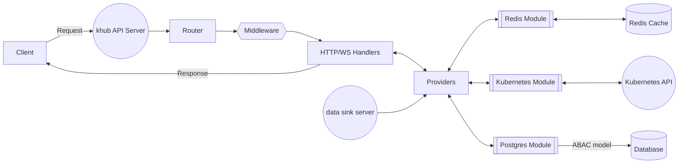
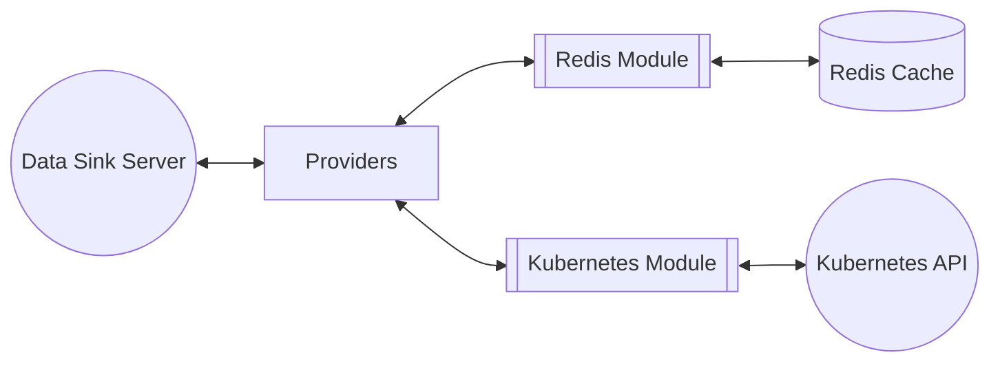
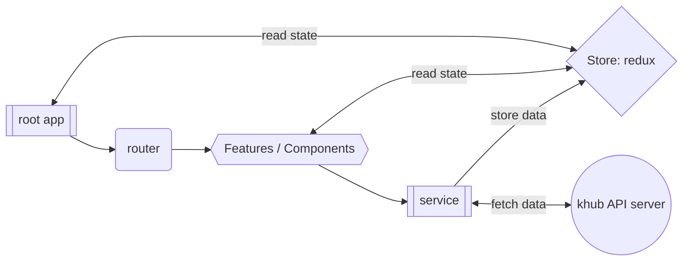

## Overview and architecture

`khub` was developed to offer a free and open source Kubernetes UI that aims to run in network isolated environments. While `khub` can run from outside the designated cluster, it is designed primarily to run 
in-cluster. Many off the shelf solutions, which often are not free, run their UI from desktop applications, and
other locations that require a larger than desirable network exposure to internal control planes. 

If you or your team wants to utilize a UI for your Kubernetes platform that is designed to run in a secure setup, 
with a built in fine-grained attribute based access control (ABAC) authorization model, `khub` is a good choice. 

As a bonus `khub` also provides a built in `MySQL` replication topology graph generator. If your teams utilize `MySQL` at a large scale, this feature can prove to be a valuable means to automatically document complex 
replication topologies. 

### Glossary:
- **client**: the react client UI
- **API Server**: the http api server
- **router**: the http router
- **middleware**: router middleware used for auth, static
  content, etc
- **Handlers**: the http and websocket route handlers
- **Providers**: the "ports" used to operate on the module
  adapters
- **Modules**: these are the adapters for underlying 
  dependencies of the system (such as datastore/repositories,
  external APIs, etc)

The khub system consists of 5 main components: 

1. **Client GUI**: the presentation layer used by our engineers (build on `reactjs`)
2. **The client API server**: the BFF (backend for front end) layer that the GUI interacts with to retrieve and update
   data.
3. **The data sink server**: a backend which monitors your Kubernetes cluster for changes and updates the
   global cache used by the API layer to retrieve data. 
4. **Redis Cache**: all data from the system is synced to a redis cache. This is primarily to protect the 
   Kubernetes api and any other APIs from which `khub` will retrieve data. 
5. **Postgres DB**: The ABAC model data is persisted in this database (Users, Groups, Permissions etc), as well as some user defined configuration.

> The underlying software architecture can be described as
"hexagonal", otherwise known as a "ports and adapters"
architecture. This design allows for easy addition and
replacement of module components as dictated by the 
software's requirements. The following diagrams will help
illustrate the flow of data in this system as it relates
to the software's architecture. This project can be considered
a "modular" monolith, such that each component runs in
separate processes from the same codebase. 
  
### Overall Architecture:

### data sink server:

### Client app (react) architecture:

###  Configuration Requirements

The application requires the following configuration settings:

- `ListenPort`: The port on which the application listens for incoming HTTP requests. This setting is required and must be an integer.

- `Timeout`: The timeout for HTTP requests in seconds. This setting is required and must be an integer.

- `Version`: The version of the application. This setting is optional and is a string.

- `Environment`: The environment in which the application is running (e.g., "development", "staging", "production"). This setting is optional and is a string.

- `LogLevel`: The level of logging to use (e.g., "debug", "info", "warn", "error"). This setting is required and is a string.

- `BaseURL`: The base URL of the application. This setting is required and is a string.

- `RedisAddress`: The address of the Redis cache. This setting is required and is a string.

- `DBUserName`: The username for the database. This setting is required and is a string. (secret)

- `DBPassword`: The password for the database. This setting is required and is a string. (secret)

- `DBHost`: The host of the database. This setting is required and is a string.

- `DBName`: The name of the database. This setting is required and is a string.

- `DBAutoMigrate`: Whether to automatically migrate the database. This setting is optional and is a boolean.

- `AuthSessionHandlerKey`: The key for the session handler. This setting is required and is a string. (secret)

- `OIDCIssuer`: The issuer for OIDC authentication. This setting is required and is a string.

- `OIDCRedirectURI`: The redirect URI for OIDC authentication. This setting is required and is a string.

- `OIDCClientID`: The client ID for OIDC authentication. This setting is required and is a string. (secret)

- `OIDCClientSecret`: The client secret for OIDC authentication. This setting is required and is a string. (secret)

- `OIDCAudience`: The audience for OIDC authentication. This setting is required and is a string. (secret)

- `K8sInCluster`: Whether the application is running in a Kubernetes cluster. This setting is optional and is a boolean.

- `K8sNamespaces`: A list of Kubernetes namespaces to monitor. This setting is optional and is a list of strings.

- `K8sClusterName`: The name of the Kubernetes cluster (displays in the UI header). This setting is required and is a string.

- `K8sDataSyncIntervalSeconds`: The interval in seconds at which to sync data from the Kubernetes cluster. This setting is required and is an integer.

## Developing

See [DEVELOPERS GUIDE](./DEVELOPERS.md)